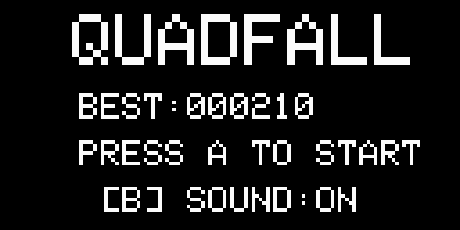

# Quadfall

Arduboy 向けのテトリスライクな落ち物パズルゲーム。

## プレイ画面



## 遊び方

### ブラウザで遊ぶ（実機不要）

1. [Releases](../../releases) から `firmware.hex` をダウンロード
2. ブラウザで [Ardens Player](https://tiberiusbrown.github.io/Ardens/) を開く
3. `firmware.hex` をドラッグ＆ドロップ

### Arduboy に書き込む

1. [Releases](../../releases) から `firmware.hex` をダウンロード
2. Arduboy を USB 接続し、以下のコマンドで書き込む

```bash
pio run --target upload
```

## 操作方法

| ボタン | 動作 |
|--------|------|
| LEFT | ピースを左に移動 |
| RIGHT | ピースを右に移動 |
| DOWN | ソフトドロップ |
| A | 反時計回り |
| B | 時計回り |
| UP | ハードドロップ |
| A+B 同時押し | ポーズ / 再開 |
| B（タイトル） | サウンドのオン/オフ切り替え |

## 開発

### 必要なもの

- [PlatformIO](https://platformio.org/)

### ビルド

```bash
# ビルドのみ
pio run

# ビルド＆Arduboy へ書き込み（USB 接続が必要）
pio run --target upload
```

## ライセンス

MIT
