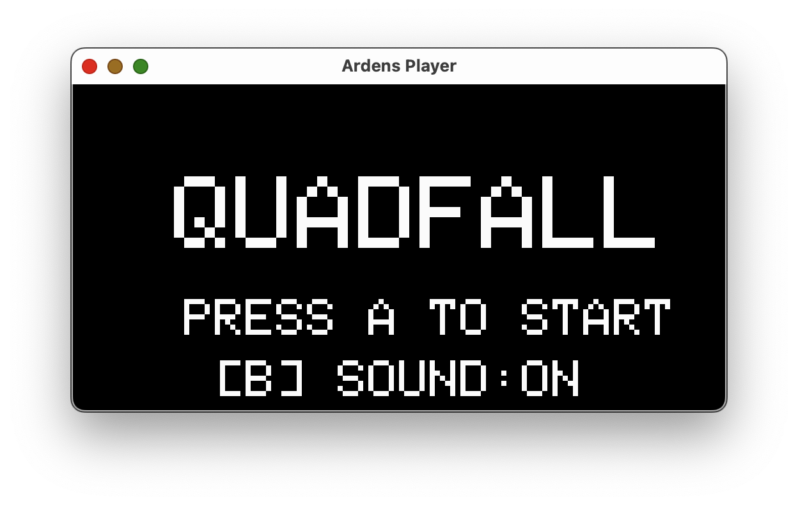
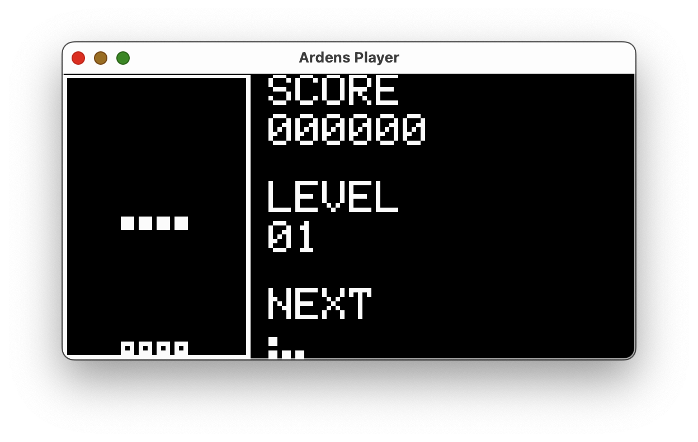
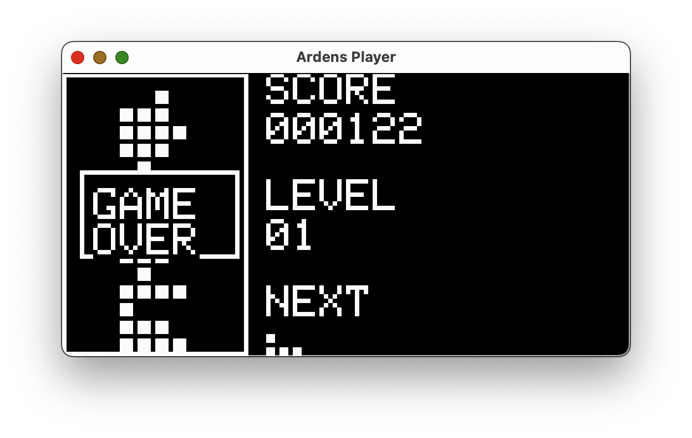

# Quadfall

Arduboy 向けのテトリスライクな落ち物パズルゲーム。

## スクリーンショット





## 必要なもの

- [Arduboy](https://www.arduboy.com/)
- [PlatformIO](https://platformio.org/)

## ビルドと書き込み

```bash
# ビルドのみ
pio run

# ビルド＆Arduboy へ書き込み（USB 接続が必要）
pio run --target upload
```

## 操作方法

| ボタン | 動作 |
|--------|------|
| LEFT | ピースを左に移動 |
| RIGHT | ピースを右に移動 |
| DOWN | ソフトドロップ |
| A | 反時計回り |
| B | 時計回り |
| UP | ハードドロップ |
| B（タイトル） | サウンドのオン/オフ切り替え |

## ライセンス

MIT
